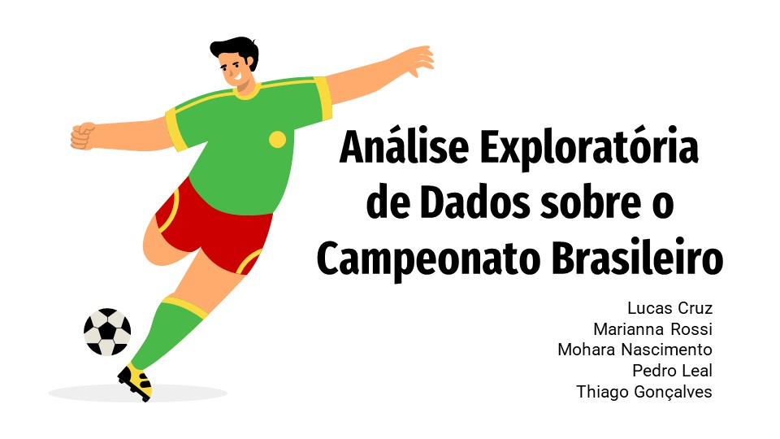

# 
**Projeto Final da disciplina Estatística I**

### **Descrição**

Este notebook apresenta uma análise de dados feita a partir de datasets de estatíticas da Série A do campeonato brasileiro de futebol, no período de 2012 a 2022. 

### **Identificação da equipe**

**Grupo 3:** Lucas Cruz, Marianna Rossi, Mohara Nascimento, Pedro Henrique, Thiago

**Programa:** Santander Coders 2023

### **Dataset**

O conjunto de dados utilizado neste projeto foi retirado diretamente do kaggle. Cuja fonte é a seguinte:

- Estatísticas do Campeonato Brasileiro: https://www.kaggle.com/datasets/saulocampos/estatsticas-do-campeonado-brasileiro
